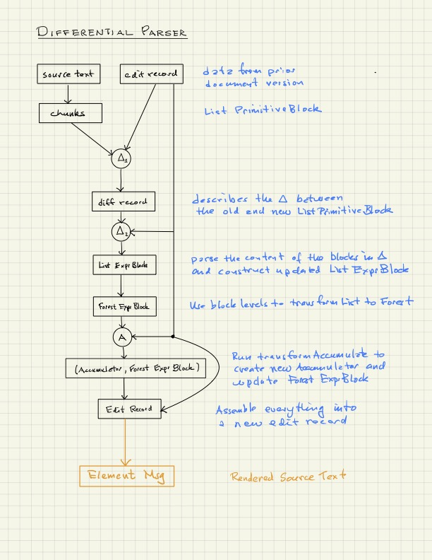

# Overview


The Scripta compiler transforms text into `Element Msg`
through a series of stages, as illustrated in the
following figure. 

1.  Break the source text into _chunks_,
namely a list of so-called _primitive blocks_. 


2. Ignoring
for the moment the possibility of diff records and
differential compilation,
parse the content of the primitive blocks, transforming
string data into lists of `Expr` 
(see [Intro, section "Internal Language"](/docs-scripta-compiler/introduction/#internal-language))


3. Transform the list of expression blocks into a forest
  of expression blocks using the indentation structure 
  or, in the case of microLaTeX, the level structure.


4. Walk through the forest of expression blocks,
accumulating data on section numbers, the
table of contents, cross-references etc, while
simultaneously updating the forest of expression 
blocks where indicated.


5. Use this data to produce a so-called
`EditRecord`, a data structure containing all the
information needed to render the original source
text into `Element MarkupMsg`, an Elm representation
of Html.


6. Use the Edit Record to produce the final rendered
text.

## Flowchart



## Parsing the internal language

Let us concentrate for the moment on step (2) above,
parsing the content of the primitive blocks.
We will do this first in the case of "pure" L0,
a simplified version of L0 described below. 
All the ideas needed in the general case, including
for microLaTeX and XMarkdown are present in this 
simple case. 

The parser first tokenizes the input, then consumes
the tokens one at a time.  To process them, it maintains
two data structures: a list of committed expressions
and a stack of "unreduced" tokens.  At each step the
parser may either commit the token or push it onto the 
stack.  The stack contents may or may not be reducible
to an expression (see XX below for examples).  
If the stack is reducible, the resulting expression 
is pushed onto the committed list. If not, the process
continues.  

If the stack is empty after
all the tokens have been consumed, the parse is
successful.  If not, there is an error, and the 
recovery procedure is called.  In rough outline, the 
procedure is as follows: (a) remove the token at the bottom
of the stack and use it to construct an expression
indicating the presence and nature of the error; 
(b) push this expression onto the committed list;
(c) restart the parser with the truncated stack 
as input.

In short, error recovery works by pushing an
error expression onto the committed list based
the state of the stack, then skipping a token
and restarting the parser.  This procedure is
guaranteed to terminate and can also handle
multiple errors. Whiile simple, it has proved
effective in the case of the three markup
languages considered here.

The strategy just described is essentially that of
a classical shift-reduce parser. The shift
operation is the act of taking a token from
the input and putting it either on the stack
or (as an expression), the committed list.
The reduce operation occurs when the stack represents
an expression: that expression is pushed onto the 
committed list and the stack is cleared.
 
### Pure L0

An element
of pure L0 text is one of the following:

- a span of pure text, e.g. "roses are red"

- a function element, e.g. `[italic roses are red]`,
consisting of a function name (italic here) and a body,
which is a sequence consisting of pure text spans and 
function elements.

- a sequence of the above.

Function elements can be nested, as in 
`[italic roses [bold are] red`".  In this 
example, "roses" and "red" are italicized,
while "are" bold italic.  Here is a slightly
more complicated example:

```text
He said that [italic roses [bold are] red]. Cool!
```


### Tokenization

Tokens for pure L0 are of the type listed below.
The constructors `LB` and `RB` refer to left and 
right brackets.  `Meta` is a meta data field that
records the location of the part of the source text 
corresponding to the token.  `S` stands for `String`
and `W` stands for white space.

```elm
type Token
    = LB Meta
    | RB Meta
    | S String Meta
```

As an example, the text "[italic roses]" tokenizes 
as 

```
LB, S "italic", S " roses", RB
``` 
where
we have ignored the Meta component.  You can verify this 
as follows:

```text
$ elm repl
> import L0.Parser.Token exposing(..)
> run "[italic roses]" |> List.reverse
```

The second token in full form is

```text
S "italic" { begin = 1, end = 6, index = 1 }
```

The index refers to the index of the token in
the token list.  It will be used in error recovery.

### Reduction of a list of tokens

Recall that expressions are of type

```elm
type Expr
    = Fun String (List Expr) Meta
    | Text String Meta
    | Verbatim String String Meta
```

The token list

```
LB, S "italic", S " roses", RB
```
represents an expression, namely

```elm
Fun "italic" [S " roses"]
```

where again we ignore the metadata.  On the other
hand, the token list 

```elm
LB, S "italic", S " roses"
```
is not reducible, since the opening `LB` is unmatched. 
See the [detailed documentation of the L0 parser](/docs-scripta-compiler/l0-parser#reducibility/)
to see how the function `isReducible : List Symbol -> Bool` works.


