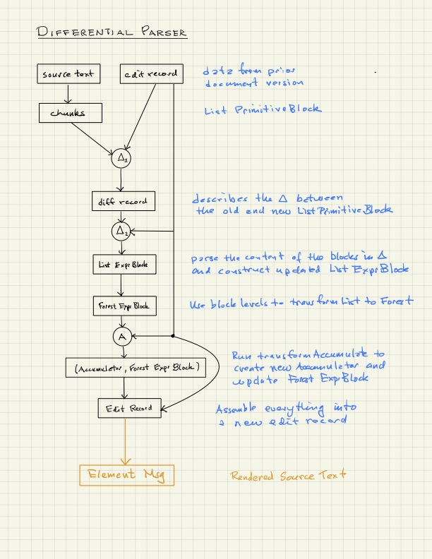

# Overview of the Scripta Compiler

The Scripta compiler translates source text written
in a markup language to an Elm representation of Html.
The languages supported are

- L0
- microLaTeX
- XMarkdown

All three are parsed to a common syntax tree.  This tree
consists of blocks whose main content is the field
`Either String (List Expr)` where

```elm
type Expr
    = Fun String (List Expr) Meta
    | Text String Meta
    | Verbatim String String Meta
```

Blocks have the rather elaborate type listed below.  
This complex structure is necessary for interactive 
real-time editing with error recovery.  By real-time we mean
that the rendered text is updated "instantaneously"
in the browser as the user types in text.  By interactive,
we mean (for example) that click on the rendered text
brings the associated source text into view while
simultaneously highlighting it.  In addition, if the 
user selects a block of source text and presses 
ctrl-S (S for 'sync'), the corresponding rendered text
is brought into view and highlighted.

```elm
type ExpressionBlock
    = ExpressionBlock
        { name : Maybe String
        , args : List String
        , properties : Dict String String
        , indent : Int
        , lineNumber : Int
        , numberOfLines : Int
        , id : String
        , tag : String
        , blockType : BlockType
        , content : Either String (List Expr)
        , messages : List String
        , sourceText : String
        , error : Maybe { error : String }
        }
```

## Flowchart

The Scripta compiler transforms text into `Element Msg`
through a series of stages, as illustrated in the 
following figure. Below we describe these stages.




The first step is to break the source text into chunks,
namely a list of so-called _primitive blocks_. Ignoring
for the moment the possibility of diff records and 
differential compilation, we traverse the left branch 
of the diagram, the penultimate step of which is the 
production of an `EditRecord`.  Data of this type
is transformed into an Elm representation of Html
by the function 

```elm
render : Int -> Accumulator -> Settings -> ExpressionBlock -> Element MarkupMsg
```
of module `Block.Render`.

```elm
type alias EditRecord chunk parsedChunk accumulator =
    { chunks : List chunk
    , parsed : List parsedChunk
    , tree : List (Tree parsedChunk)
    , accumulator : accumulator
    , lang : Language
    , messages : List String
    , initialData : InitialData
    }
```


In the case of L0 and XMarkdown, a primitive
block is defined by

```elm
type alias PrimitiveBlock =
    { indent : Int
    , lineNumber : Int
    , position : Int
    , content : List String
    , name : Maybe String
    , args : List String
    , properties : Dict String String
    , sourceText : String
    , blockType : PrimitiveBlockType
    , error : Maybe { error : String }
    }
```

In the case of
MicroLaTeX, there are two additional fields,
`level: Int` and `status: Status`.  